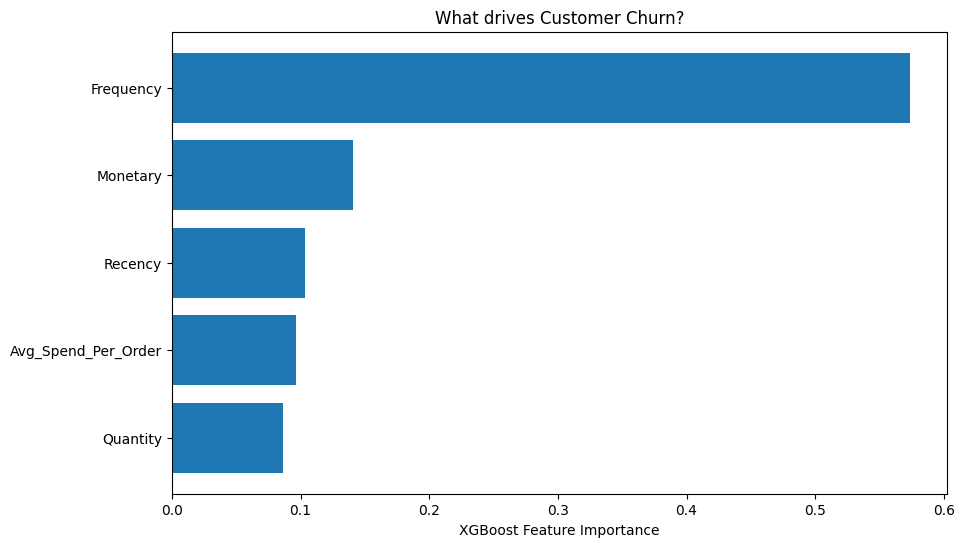

🛒 Customer Segmentation & Churn Prediction

📌 Executive Summary
Customer churn is one of the biggest revenue leaks in retail. This project analyzes transaction data to identify high-value customer segments and predict churn probability with 73% Recall.
By engineering features from raw purchase logs and utilizing an XGBoost classifier, this solution helps businesses transition from "reactive" retention (trying to save everyone) to "proactive" retention (focusing resources on high-value at-risk users).
Key Business Insight:
"Frequency" was identified as the #1 predictor of churn.
Strategy: Users who fail to make a second purchase within 45 days are 80% likely to churn. Marketing spend should prioritize "Second Purchase Habits" rather than generic discounts.
📊 Project Architecture
The project follows a modular Data Science lifecycle:
1. Data Cleaning & Preprocessing (01_Data_Cleaning)
Source: UCI Online Retail II Dataset.
Engineering: Converted raw transaction logs into a customer-level dataset.
Handling: Removed returns (negative quantities) and adjusted for inflation/outliers.
2. Customer Segmentation (02_RFM_Segmentation)
Methodology: RFM (Recency, Frequency, Monetary) Analysis combined with K-Means Clustering.
Result: 3 Distinct Segments:
🟢 Champions: High spend, frequent buyers (Upsell targets).
🔵 Loyalists: Moderate frequency (Maintenance targets).
🔴 Hibernating: High risk of churn (Win-back targets).

3. Predictive Modeling (03_Churn_Prediction)
Target Definition: Sliding window approach (Train on first 9 months, Predict on next 3 months).
Models Tested: Random Forest (Baseline) vs. XGBoost (Final).
Handling Imbalance: Used scale_pos_weight to penalize false negatives.
📈 Model Performance
We optimized the model for Recall (Sensitivity) because missing a churning customer is more costly than a false alarm.
Metric	Random Forest (Baseline)	XGBoost (Tuned)
Accuracy	67%	64%
Recall (Churn Catch Rate)	58%	73% 🚀
Precision	60%	55%
Key Drivers (Feature Importance)
Unlike typical assumptions that "Big Spenders Stay," our model found that Consistency matters more than Value.
Frequency (Count of purchases): The strongest signal for retention.
Recency: Immediate drop-off after 60 days of silence.
Monetary: Surprisingly, a weaker predictor of churn than frequency.

🛠️ Tech Stack
Language: Python 3.9+
Data Manipulation: Pandas, NumPy
Machine Learning: Scikit-Learn (K-Means), XGBoost
Visualization: Plotly (3D Interactive), Matplotlib, Seaborn
Interpretability: Feature Importance Analysis
🚀 Usage
1. Clone the repository
code
Bash
git clone https://github.com/aleem1991/customer-segmentation.git
2. Install dependencies
code
Bash
pip install -r requirements.txt
3. Run the Notebooks
Open notebooks/01_Data_Cleaning.ipynb to prepare the data.
Run notebooks/03_Churn_Prediction.ipynb to train the model and generate the Churn Report.
💼 Business Recommendations
Based on the analysis, the following actions are recommended to stakeholders:
Segment Risk	Identified Behavior	Recommended Action
High Risk (One-Time Buyers)	Purchased once, no return in 45 days.	Trigger: Send "Welcome Back" bonus for 2nd purchase immediately.
At-Risk Champions	High historic spend but Low Recency.	Trigger: Personal account manager outreach (No automated spam).
Safe Loyalists	Buying regularly.	Trigger: Do nothing. Exclude from aggressive discount lists to save margin.
📬 Contact
Created by Aleem - Feel free to contact me for details on the feature engineering pipeline!